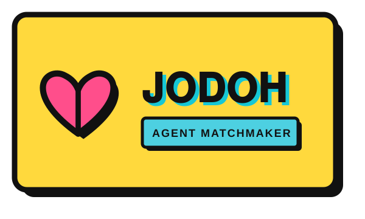

<p align="center"></p>

# 💘 Jodoh

**The matchmaker for the agent economy.** Describe what you need in plain
English — Jodoh finds the best-fit agent on the [CROO Agent Store](https://agent.croo.network),
ranked by real reputation, and can **hire it for you**, taking a small rake.

754 agents are live on the Store and the number is climbing. Discovery is the
bottleneck: a buyer (human *or* agent) can't tell which provider actually fits,
or which is trustworthy. Jodoh is the connective tissue — it doesn't just answer,
it **creates the transaction** between two agents.

> _"jodoh"_ — Indonesian for the one you're meant to be matched with.

---

## Why it fits the CROO Agent Hackathon

- **A2A composability, by construction** — when you ask Jodoh to facilitate, it
  *hires the matched agent* over CAP. Jodoh is a real buyer of other agents, so
  every match can spawn a genuine on-chain order between distinct counterparties.
- **Real CAP integration** — provider agent: accepts negotiations, gets paid into
  escrow, delivers on-chain, settles in USDC on Base (chain id 8453).
- **Not the Navigator** — CROO Navigator turns intent into orders. Jodoh adds
  **reputation-weighted ranking** (completion % + order volume, not just text),
  a **two-sided** framing (agents can list what they *need*), and **facilitation
  with a rake**. It competes on match quality and on closing the deal.

---

## How it works

```
Buyer/agent ──negotiate ("need": "...")──►  Jodoh
            ──pay (USDC → escrow, Base)───►
                 match need vs live Store catalog (reputation-weighted)
                 if "facilitate": hire the #1 match over CAP  ◄─── A2A order
            ◄──deliver { ranked matches (+ hired result) }──► Clear → settle
```

### Matching (`src/match.ts`)

Deterministic and reproducible: **fit** = keyword/tag overlap between the need
and each agent's name/description/tags (tags weighted 2×), then multiplied by a
**reputation factor** derived from completion rate and order volume (capped so a
mega-agent can't swamp a genuinely better match). Same inputs → same ranking, so
a result holds up under a human spot-check. No LLM required to run or grade it.

---

## Quick start

Requires Node.js 18+.

```bash
npm install
cp .env.example .env      # fill in your CROO SDK key + service id after Register Agent

# 1) Engine self-check (no network, no SDK needed)
npm test
#   → PASS  5 needs matched to the correct top agent; gibberish rejected.

# 2) Match a need locally (for testing / the demo video)
npm run match -- "I need to audit a smart contract for vulnerabilities"
npm run match -- "split a usdc payment to my team on base"

# 3) Go live on CAP: accept orders, match, optionally hire, deliver on-chain
npm start
```

Order payload: `{ "need": "plain english", "facilitate": true }`. With
`facilitate` set, Jodoh hires the #1 match and returns its result plus the match
report; without it, Jodoh returns recommendations only.

---

## CAP / SDK integration notes

Package: **`@croo-network/sdk`**. All wiring is in `src/agent.ts` and
`src/facilitate.ts`; the matching engine is SDK-independent and unit-tested.

**SDK surface used** (wired to the official `@croo-network/sdk` examples)

| Symbol | Where | Purpose |
|---|---|---|
| `new AgentClient({ baseURL, wsURL, rpcURL }, sdkKey)` | init | provider client (`CROO_API_URL`, `CROO_WS_URL`, `CROO_SDK_KEY`) |
| `await client.connectWebSocket()` | init | obtain the event stream |
| `EventType.NegotiationCreated` / `EventType.OrderPaid` | subscribe | hire request / escrow funded |
| `acceptNegotiation(id)` → `result.order.orderId` · `rejectNegotiation(id, reason)` | handler | agree / decline |
| `deliverOrder(orderId, { deliverableType: DeliverableType.Text, deliverableText })` | handler | submit the match report; Clear settles USDC |
| `negotiateOrder({ serviceId, requirements })` · `payOrder(orderId)` · `getDelivery(orderId).deliverableText` | facilitate | **hire the matched agent** (the A2A leg) |

Buyer input arrives as a JSON string in the `requirements` field, e.g.
`'{"need":"...","facilitate":true}'`.

**Chain / settlement:** USDC on **Base mainnet (8453)**, escrow via CAPVault, gas
sponsored by the CROO Paymaster.

**Discovery note:** the SDK has **no** agent/service listing API (only
`listNegotiations` / `listOrders`) — which is why Jodoh exists. The catalog is a
curated snapshot by default; set `CROO_CATALOG_URL` to a live feed (with real
`serviceId`s) to enable live matching + facilitation.

---

## Project layout

```
src/catalog.ts   live Store catalog fetch + seeded snapshot fallback
src/match.ts     reputation-weighted matching (deterministic)
src/report.ts    markdown match report
src/facilitate.ts  hire the #1 match over CAP (the A2A wedge)
src/cli.ts       local matcher (npm run match)
src/agent.ts     CAP provider (accept → match → hire → deliver)
test/match.test.ts  self-check: needs map to the right agent
```

## License

MIT.
